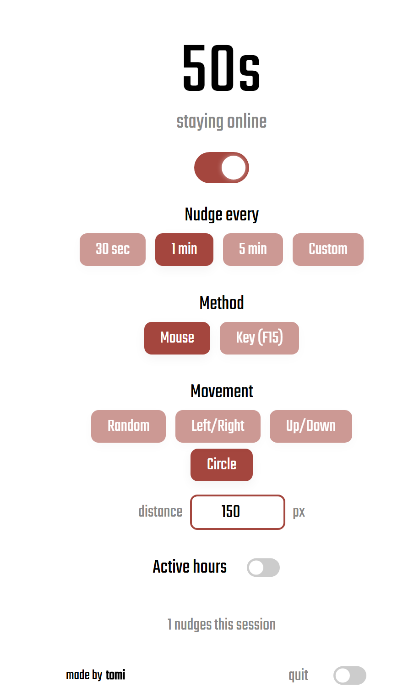
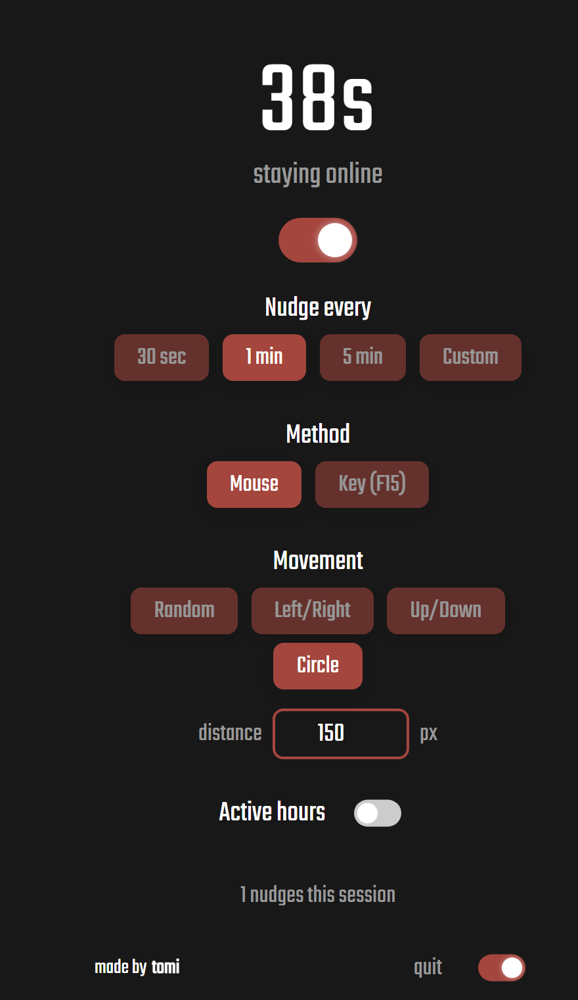

<h1 align="center">No Sleep — Mouse</h1>

<p align="center">
  A dead-simple, open-source <b>mouse jiggler</b> / stay-online helper.<br>
  Keeps you showing as <b>online</b> in Slack, Teams &amp; Discord — and your screen awake.
</p>

<p align="center">
  <a href="LICENSE"></a>
  <a href="#platform-support"></a>
  <a href="#quick-start"></a>
  <a href="https://github.com/T0M13/NoSleep-Mouse/releases/latest"></a>
</p>

<p align="center">
  
  &nbsp;&nbsp;
  
</p>

---

## What it does

Apps like Slack mark you **away** after a few idle minutes. No Sleep gently nudges
real input — a tiny mouse move or an invisible key press — every so often, so the
idle timer never trips and you stay **active**.

- 🖱️ **Visible, configurable movement** — pick direction (random / left-right /
  up-down / circle) and distance in pixels. Or go **invisible** with an F15 keypress.
- ⏱️ **Your interval** — every 30s, 1m, 5m, or whatever you want.
- 🕘 **Active hours** — only run between, say, 09:00 and 17:00.
- 🪶 **Zero setup on Windows** — it's just a script that ships with what Windows
  already has. Double-click and go.
- 🖥️ **Web UI _and_ command line** — use the dashboard or drive it from a terminal.

## Quick start

Grab the zip for your OS from the **[latest release](https://github.com/T0M13/NoSleep-Mouse/releases/latest)**
and unzip it. (Or clone the repo and use the matching folder.)

### Windows
1. Unzip **`NoSleep-Mouse-Windows.zip`**.
2. Double-click **`Start.bat`**.
3. The dashboard opens in your browser. Flip it on. Done.
4. **Close the tab to stop** (the background helper shuts itself down).

Prefer the terminal?
```powershell
powershell -ExecutionPolicy Bypass -File server.ps1 -Console -Interval 30 -Dir circle -Distance 150
```

### macOS
Unzip **`NoSleep-Mouse-macOS.zip`**, then:
```bash
chmod +x nosleep.command && ./nosleep.command -i 30 -r circle -d 150
```
Uses the built-in `osascript` — no installs, but grant **Accessibility** permission
once (System Settings → Privacy & Security → Accessibility). See [`macos/`](macos/).

### Linux
Unzip **`NoSleep-Mouse-Linux.zip`**, then:
```bash
chmod +x nosleep.sh && ./nosleep.sh -i 30 -r circle -d 150
```
Needs `xdotool` (X11) or `ydotool` (Wayland). See [`linux/`](linux/).

## Platform support

| OS | How | Installs needed | Status |
|----|-----|-----------------|--------|
| **Windows** | Web UI **+** CLI | None | ✅ Tested |
| **macOS** | CLI (`osascript`) | None (needs Accessibility permission) | 🧪 Best-effort |
| **Linux** | CLI (`xdotool`/`ydotool`) | One input tool | 🧪 Best-effort |

> The macOS and Linux scripts are written to be correct but **haven't been tested on
> real hardware** — feedback and PRs welcome.

## Will it actually keep me online?

- ✅ **Desktop Slack / Teams / Discord** decide "away" from your computer's idle
  timer. Real input resets it, so you stay green. This is the main use case.
- ⚠️ **Slack in a browser tab** leans on tab focus, so it's less reliable.
- ❌ It works only **on this machine, while it's running**. It won't keep you online
  on your phone, and it won't override a **locked or sleeping** computer.

## Settings at a glance

| Setting | Options |
|---------|---------|
| **Interval** | 30s · 1m · 5m · custom |
| **Method** | `mouse` (visible glide, returns to start) · `key` (invisible F15) |
| **Direction** | `random` · `horizontal` · `vertical` · `circle` |
| **Distance** | 1–2000 px |
| **Active hours** *(Windows UI)* | any time window, incl. overnight |

## Be reasonable

This is for the honest "don't flag me away while I'm reading / on a call / thinking"
annoyance — not for faking hours you aren't working. Use responsibly.

## License

[MIT](LICENSE) — do whatever, just keep the notice.

---

<p align="center">
  made by <a href="https://www.tamas-illes.com">tomi</a> ·
  styled after the <a href="http://nosleep.tamas-illes.com/">No Sleep</a> extension
</p>
